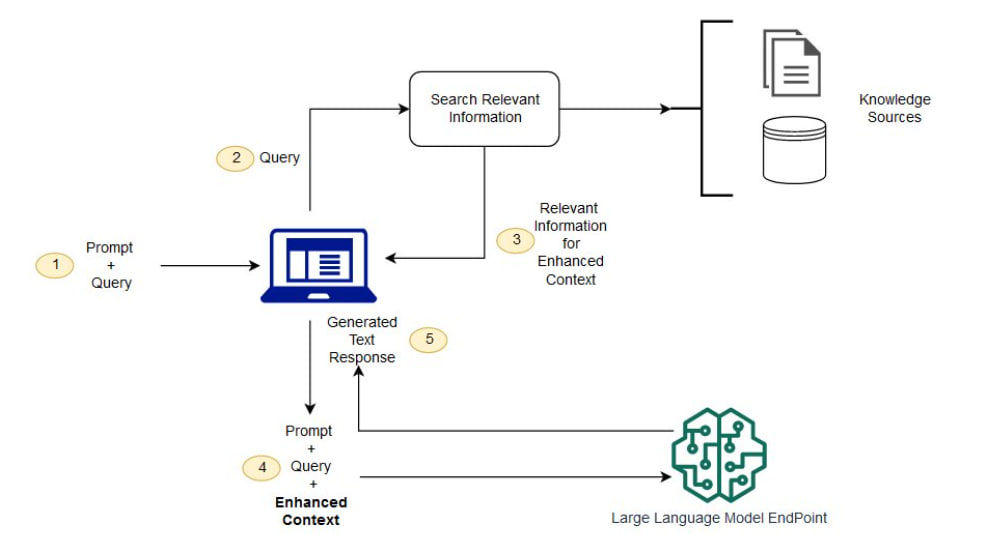

# GenAI-Platform

## Introduction to GenAI-Platform

GenAI-Platform is a multi-API platform, offering a range of functionalities including chatbot interactions, user management, and payment processing. It leverages Sanic as the primary framework, providing a comprehensive set of APIs for developers.

## Project Description

`GenAI-Platform` is an application based on the Retrieval Augmented Generation (RAG) framework. RAG combines large language models (LLM) with external knowledge sources to enhance the capabilities of question-answering systems.



### Why Choose RAG?

#### Challenges with Knowledge Update in LLMs

- The training datasets of LLMs are static, making it challenging to update their knowledge base post-training.
- The sheer size of LLM parameters makes fine-tuning a resource-intensive and time-consuming process.
- Directly querying or editing the knowledge encoded within the billions of parameters in LLM is impractical.

As a solution, RAG was introduced to enable continuous learning and knowledge acquisition for LLMs.

#### How RAG Works

1. **Knowledge Indexing**: Text data is processed, vectorized using techniques like word embedding, and stored in a database to form a searchable vector index.
2. **Knowledge Retrieval**: Upon receiving a query, RAG searches the knowledge base to find the most relevant documents.
3. **Answer Generation**: RAG feeds the query and retrieved documents to the LLM, allowing it to integrate this external knowledge and generate responses.

This allows LLMs to utilize an external knowledge base without altering their parameters. With the knowledge base being updated, new knowledge can be injected into LLMs in real-time.

#### Advantages of RAG

- Enhances LLM reasoning and factual capabilities with a vast external knowledge base.
- Facilitates rapid prototyping.
- Knowledge indexing allows for real-time knowledge updates.
- The generated responses are highly interpretable.

#### Disadvantages of RAG

- Possible retrieval of irrelevant documents during the knowledge retrieval phase.
- Generated responses may lack some fundamental world knowledge.
- The vector database faces challenges in handling vast amounts of data.
- Preprocessing and vectorization in inference add computational overhead.
- Updating the external knowledge base requires significant resources.

### Summary

In the `GenAI-Platform` project, we use the RAG framework to build a powerful, real-time updated, and highly interpretable question-answering system. While there are technical challenges, the advantages make the project capable of providing smarter and more efficient services.

## Key Features and Highlights of the Project

### Features:

1. **Intelligent Chatbot**: Based on OpenAI's GPT model and combined with a qdrant-client vector database for preprocessing, it provides real-time, accurate intelligent responses.
2. **User Management**: Offers complete functionalities for user registration, login, logout, and supports captcha and email verification.
3. **Message Management**: Allows users to retrieve, share, delete messages and message groups, supporting streaming processing.
4. **Payment System**: Integrates payment functionalities, enabling users to check payment card information, order inspection, and account queries.
5. **Multilingual Model Linking**: Utilizes the langchain tool to link different language models and integrate them into the project's features.

### Highlights:

1. **Performance**: Powered by the Sanic web framework, it supports asynchronous request handling for rapid response.
2. **Security**: Incorporates various security measures, such as password hashing, captcha validation, and token authentication.
3. **Scalability**: Designed with modularity in mind, allowing for the easy addition of new features and modules.
4. **Cross-Platform Compatibility**: Developed in Python, supporting various operating systems and platforms.
5. **Data Handling**: Equipped with strong data processing capabilities, using tools like pandas and numpy for data cleaning, analysis, and operations.
6. **Blockchain Integration**: Facilitates interactions with the Ethereum blockchain via the web3 library, opening avenues for future blockchain applications.

## Installation and Execution

1. **Project Installation**:

```bash
cd GenAI-Platform
pip install -e .
```

2. **Load Vector Database Content:**:

```bash
cd GenAI-Platform
python app.py -a .
```

3. **Run the Platform:**:

```bash
cd GenAI-Platform
python app.py .
```


